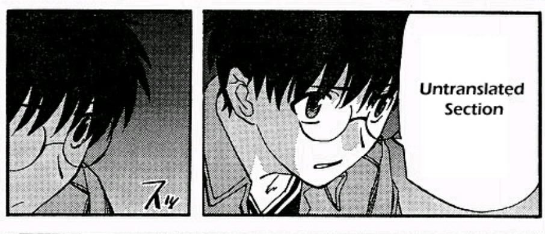

# Translation Guidelines

!!! warning "Stub"
    This page is a [stub][wikipedia-stubs].
    You can help by [expanding it][contributing].

    ??? question "How can I help?"
        You can help by writing guidelines for translation.
        This should cover things such as:

        - Character voice
        - Romanisations styles
        - How to work with an editor
        - Finding and using closed captions
        - Song/poetry/etc. translation
        - Onomatopoeia

        You can also help by providing concise examples of working
        from a pad vs. a pre-timed script.

The core of any project,
fansub or otherwise,
is its translation.
Without a translation,
there's nothing to edit,
nothing to typeset,
and nothing to style.
However,
translation is a very complex topic,
rife with many different schools of thought
and philosophies,
and many different approaches
to tackling it.

This document will cover
some of the basics
of writing translations for anime
and the required skills,
how to get started
as an aspiring translator,
how to prepare your scripts,
how to communicate with your editor,
and other more technical aspects.

!!! info "Different Approaches"
    There are many different approaches to translation,
    and no single "right" way to do it.
    This document will be biased
    towards the "interpretive" philosophy,
    as that is what Kaleido primarily follows.
    However,
    this does not mean
    that other approaches
    are wrong or ineffective.
    Different groups have different preferences,
    and each translator should find out
    what works best for them.

## Basic required skills

Being proficient in both source and target languages
is just the foundation of translation work.
A good translator needs to master
many additional skills
that apply across all translation philosophies.
Below are some of the key skills
that every competent translator
is expected to have.

### Strong Writing Ability

Language proficiency alone
doesn't guarantee good writing skills.
While editors are there to polish
the final script,
translators must provide a solid foundation:
accurate translations that read naturally
in the target language.

Since editors often don't understand
the source language,
they rely heavily on the translator's ability
to capture both the original's meaning
and general writing style.
Clear, well-written translations
makes the editor's job easier,
and often leads to a better final script.

### Writing Conventions

Perhaps the most crucial skill
is a deep understanding of writing fundamentals
and conventions,
as well as how they are applied
in the source language.
This means mastering dialogue construction,
maintaining consistent style,
understanding tropes and clichés[^tropetalk],
and paying careful attention to detail.
A translator needs to grasp
how dialogue flows naturally,
how character voices remain distinct,
and how narrative structures work together.

Beyond that,
an important skill
is also to understand
how well the _author_
understands these principles.
Literary works will often
be written concisely,
maintain a clear structure,
and follow a style guide.
Many light or web novels,
on the other hand,
will not strictly adhere to these principles,
as many authors have not been trained
in writing fundamentals.

While editors typically have a stronger command
over writing fundamentals
and can adapt content
to target language conventions,
translators are uniquely positioned
to interpret the source material's nuances
and convey them accurately
in the target language.

!!! info "Writing Conventions"

    For more information on important writing skills,
    see the [Editing](../roles/editing.md) guide
    which goes into more detail.

### Broad knowledge base

A translator must have a deep understanding
of both the source
and target cultures.
Every piece of media reflects
the cultural context
of its creation,
from social norms
and historical events
to colloquialisms
and pop culture references.
Having a good grasp of these elements
helps translators accurately interpret
the author's intent
and find appropriate equivalents
in the target language.

Beyond cultural knowledge,
translators need expertise in various fields
depending on the content they're translating.
To name some examples:

- School-based settings
  will often require knowledge
  of common social norms
  in the source culture
  and how they can be mapped
  to the target culture
- Supernatural shows often draw
  from mythology, folklore, and religion,
  as well as how these are commonly interpreted
  and portrayed in the source culture
- Mecha series might require understanding
  of military terminology and combat tactics,
  as well as mecha anime history
  to understand references
  to older well-known mecha shows
- Sports series demands knowledge
  of the specific sport's rules and jargon,
  and how they differ
  between the source language
  and the target language

The broader your knowledge base,
the better equipped you'll be
to handle any subject matter
that may come up.

### Research skills

Even the most experienced translators
regularly encounter unfamiliar concepts
that require extensive googling.
Strong research abilities are crucial
for understanding specialised terminology,
verifying cultural references,
and finding authoritative sources.
This might mean digging through research papers,
asking experts online for help,
or spending hours tracking down
the origin of an obscure reference.

### Creative problem-solving

Translation often presents challenges
that can't be solved with dictionaries alone.
When direct translations fall flat
or cultural concepts don't align,
translators must think creatively
to preserve the original meaning and impact.

This might mean:

- Reimagining metaphors or idioms
  that don't translate directly
- Adapting pop culture references
  to ones the target audience will understand
  and have the same impact
- Handling speech patterns and dialects thoughtfully
  by finding equivalents that feel natural
  without falling into stereotypes
- Working with wordplay and puns
  by creating new ones that work in the target language
  while maintaining the spirit of the original
- Balancing character voices
  to maintain their distinct personalities
  across language barriers

Experience helps develop this skill,
as you build a mental library
of successful solutions
to common translation challenges.

### Dedication and patience

Fan translation is a labour of love
that demands significant time and effort
without monetary compensation.
The work can be challenging and frustrating,
requiring extensive research
and careful attention to detail.
You'll face complex problems
that need time to solve properly,
and you'll need to maintain motivation
through long projects.

Many translators find satisfaction
in creating high-quality work
that helps others enjoy content
they couldn't otherwise access.
Without this deep-seated dedication,
projects often remain unfinished
or fall short of their potential.

## Philosophies and approaches

Translation approaches exist along a spectrum
between two main philosophies:
"domestication" and "foreignisation".
Domestication adapts content
to feel natural in the target culture and language,
while foreignisation tries to preserve as many elements
of the source culture and language as possible.

In practice,
most translations strike a balance between these philosophies
based on context and specific translation challenges.
While heavy domestication might involve changing character or place names to local equivalents,
even highly interpretive translations rarely make such dramatic adaptations.

### Conservative translation

This foreignisation-based approach prioritises fidelity
to the source text's literal meaning,
staying as close as resonably possible
to the original phrasing and structure.
Many new translators gravitate toward this style,
as do viewers who prioritise "accuracy"
above other considerations.

While this approach reliably conveys basic meaning,
it often struggles with the author's voice and style.
Cultural context and implications get lost,
and wordplay or humour rarely survives
the journey between languages.
Perhaps most importantly,
the resulting text often comes across
as unnatural or stilted
in the target language.

Conservative translation often keeps terms untranslated
and relies heavily on translation notes.
These techniques, while seemingly "safe",
can actually diminish the viewer's experience.
Untranslated terms create barriers to understanding
and translation notes interrupt reading flow
and almost always give readers
a false sense of deeper understanding.

### Interpretive translation

This domestication-based approach aims to recreate
the source text's intended effect
and emotional resonance
in the target language.
Rather than translate literally,
interpretive translators work
to evoke the same feelings and reactions
in their audience as the original did.

Experienced translators often prefer this method
as it lets them faithfully capture
the author's unique voice, style, and creative vision.
Through adaptation,
they preserve the essence of wordplay and humour
by crafting culturally-relevant equivalents
that authentically connect with the target audience.

Despite its advantages,
interpretive translation has notable drawbacks.
It's easier to accidentally stray
from the original's core message
or miss important story elements
when taking creative liberties.
It also requires significantly more time and expertise
than conservative translation,
making it challenging for new translators to master.

### Striking the right balance

The challenge lies in striking the right balance.
Too conservative,
and the translation feels stiff;
too interpretive,
and it risks straying
from the source material's intent.
Successful translations attempt to blend both methods,
remaining faithful to the source material's core message
while adapting the delivery to feel natural and engaging
for the target audience.

Most modern fansub groups,
including Kaleido,
favour an interpretive approach
that prioritises natural,
idiomatic expression in the target language.
Common terms like "otaku" and honorifics
may still be retained
when their usage
adds meaningful context or flavour,
but the focus remains on conveying
the intent behind each line
rather than translating word-for-word.
After all,
an untranslated term
may not fail at conveying the intended meaning,
but it will fail at conveying _any_ meaning.

## On translation notes

Translation notes are a last resort,
full stop.
They are only to be used
when there is no alternative
to conveying the intended meaning
through any other means.
Your job as a translator
is not to educate viewers
about Japanese language or culture,
but to accurately express the content.
Consider carefully whether each note
is truly necessary to comprehend the show.
A high number of translation notes
(or depending on who you ask,
_any_ amount of translation notes)
indicates that the translator
did not do a good enough job
of conveying the meaning
through translation.

If you want to include extra cultural information
that isn't essential to understanding the plot,
add it to your release description
or a wiki page instead,
not as big blocks of text
on the screen during the show.
An exception to this rule
may be an alternative,
fully opt-in track
meant for viewers
who have already watched the show
and want to know more about the finer details,
such as the reasoning behind translation choices,
or explanations behind references.

<!-- TODO: Write about common issues you run into (based on https://web.archive.org/web/20121102204456/http://en.anime-wiki.org/wiki/Basic_Translator_Guide#General_Issues) -->

## Preparing a script

Modern translators typically work in one of two ways:

1. Working from a pad
2. Working from a pre-timed script

We recommend working from a pre-timed script,
as it allows you to more easily account for line length,
and allows you to easily play back specific lines.

Most translators will work with both.
Dialogue is typically written in a pre-timed script,
but signage may be written on a pad instead.

### Working from a pad

...

### Working from a pre-timed script

...

[//]: # (stubs)
[contributing]: https://github.com/Kaleido-subs/style-guide/pulls
[wikipedia-stubs]: https://en.wikipedia.org/wiki/Wikipedia:Stubs
[8thsin]: https://web.archive.org/web/20141021201922/http://8ths.in/fantranslation-guide/
[tropetalk-playlist]: https://www.youtube.com/playlist?list=PLDb22nlVXGgcljcdyDk80bBDXGyeZjZ5e

[^8thsin]: Many parts of this document concerning basic translation skills are based on [8th Sin's Fan Translation Guide][8thsin].
[^tropetalk]: A great resource for learning about many tropes in writing is the [TropeTalks series by Overly Sarcastic Productions][tropetalk-playlist].
